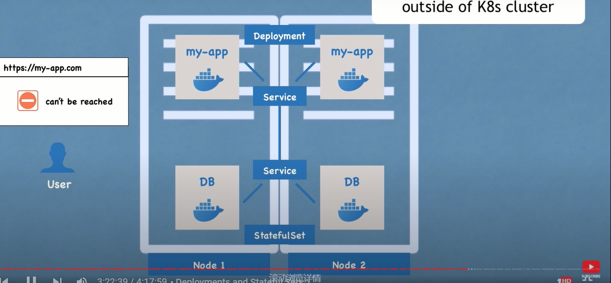
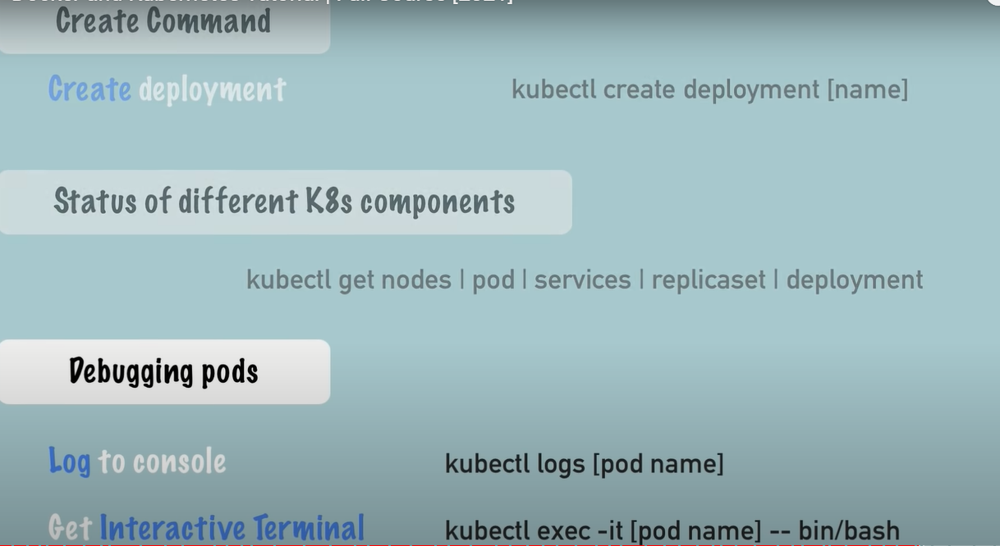
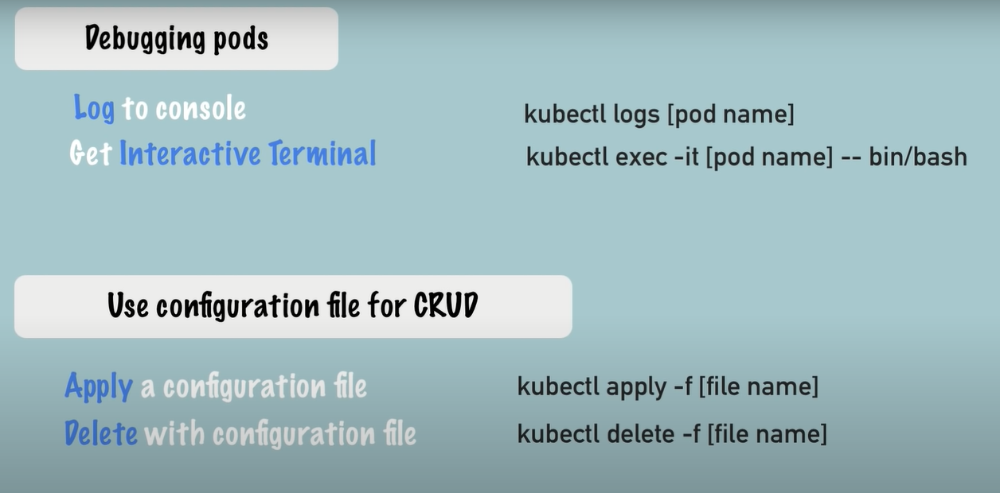

- docker build -t user-service-api:latest .

- docker ps

- docker rm -f $(docker ps -aq)

-  docker run --name user-service-api -d -p 3000:3000 user-service-api

### reduce image size

- `https://www.alpinelinux.org/about/`
    - pulling alpine image ``dcoerk pull node:lts-alpine``

- 删除none images
- `docker rmi $(docker images -f “dangling=true” -q)`

- docker inspect to inspect container info
- docker logs container_id
- docker exec -it container_id /bin/bash

### k8s
-----------------
- node and pod
  - Master node && Worker node
  - pod
    - Smallest set of k8s
    - abstraction over container 
    - usually 1 application per pod
    - each pod has its own ip address
    - new ip address on re-creation
  - service
    - permanent ip address
    - load balancer
    - lifecicle of pod and service not connected
  - Ingress
  - configMap
    - external configuration of your application
  - secret
    - used to store secret data
    - base64 encoded
  - volume
    - local
    - remote
    - k8s doesn‘t management data persistence
  

